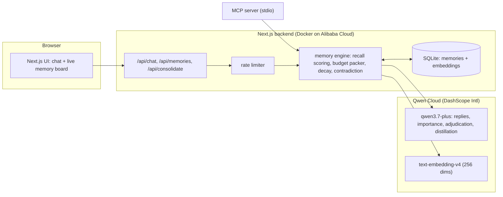

# engram

**A memory engine for AI agents: typed memories, budget-bounded recall, timely
forgetting, and contradiction adjudication.** Built on Qwen Cloud for the Global AI
Hackathon (Track 1: MemoryAgent).

Agents forget everything between sessions, or "solve" it by stuffing the whole chat
history into context: cost grows without bound, stale facts linger forever, and
contradictory facts coexist silently. Engram treats memory as an engineering problem
with three parts most memory demos skip:

1. **Selection.** What is worth recalling for THIS turn, under a hard token budget?
2. **Forgetting.** What should stop being recalled, and when?
3. **Truth maintenance.** What happens when new information conflicts with old?

## What it does

- **Typed memories.** `preference`, `fact`, `skill`, `episode`, each with its own decay
  half-life. An LLM scores the importance of every chat message and consolidation
  draft at write time; low scorers are observed but never stored (the UI shows the
  decision either way). MCP writes accept caller-set importance.
- **Budget-bounded recall.** Every turn, active memories are ranked by a blend of
  embedding similarity (`text-embedding-v4`, 256 dims), retention, importance, and
  access frequency, then greedily packed under a hard token budget (default 800). The
  packer provably never exceeds the budget (property-tested), and smaller memories
  backfill when a top-ranked one does not fit.
- **Timely forgetting.** Ebbinghaus-style exponential retention over time since last
  access; important memories decay slower, and every recall refreshes retention.
  Below the floor a memory is marked `decayed`: excluded from recall, never deleted
  (the audit trail survives).
- **Contradiction adjudication.** On every chat and consolidation write, the nearest
  active memories above a similarity threshold are adjudicated by `qwen3.7-plus` (strict JSON, temperature 0,
  fail-safe parsing: a parser failure never supersedes anything). Conflicting old
  memories are marked `superseded` with a pointer to their replacement.
- **Session consolidation.** On demand, a session transcript is distilled into typed
  durable memories through the same adjudicated write path.
- **Live memory board.** The UI shows every engine decision as it happens: recalled,
  stored, not stored (with the importance score), superseded, decayed.
- **MCP server.** The same engine is exposed over the Model Context Protocol
  (`engram_remember`, `engram_recall`, `engram_list`), so any MCP-capable agent can use
  Engram as its memory backend: `pnpm mcp`.

## Architecture



One turn through `/api/chat`:

1. Decay sweep persists forgetting.
2. The message is embedded; active memories are scored and packed under the budget;
   selected memories get their retention refreshed.
3. `qwen3.7-plus` answers with the recalled memories in its system prompt (and is
   explicitly instructed not to claim memories it was not given).
4. The message's importance is LLM-scored; if it clears the threshold it is written
   through contradiction adjudication, superseding what it conflicts with.

## Run it

```bash
pnpm install
cp .env.example .env.local   # add your Qwen Cloud API key
pnpm dev                     # http://localhost:3000
pnpm test                    # 67 unit tests, no network
```

Docker (the image the Alibaba Cloud deployment runs; see Deployment):

```bash
docker build --platform linux/amd64 -t engram .
docker run -p 3000:3000 -e QWEN_CLOUD_API_KEY=... engram
```

## Engineering notes

- The engine core (scoring, budget packing, contradiction logic, distillation
  parsing) is pure TypeScript with injected clock, embedder, and adjudicator; the
  store is a thin better-sqlite3 wrapper tested against `:memory:`. All 67 tests run
  in milliseconds with zero network. The budget packer
  has a property-style test over randomized pools; the adjudicator tests pin both the
  supersede and the no-supersede paths, plus the threshold gate that keeps unrelated
  memories from ever reaching the LLM.
- All model calls run at temperature 0. Every LLM output that feeds a decision
  (importance, adjudication, distillation) goes through a defensive parser that
  degrades safely on garbage: default importance, never-supersede, empty draft list.
- The API key lives server-side only. The model-calling endpoints (`/api/chat`,
  `/api/consolidate`) are rate limited (Upstash when configured, in-memory fallback
  otherwise); `/api/memories` is a cheap read-only snapshot with no model calls.

## Demo mode

`/?demo=1` (plus `&scene=fresh|stored|recall|decay`) renders frozen replays so the
UI can be captured without racing live calls. Every reply, score, and event is a
real output captured on 2026-07-06 from live `qwen3.7-plus` + `text-embedding-v4`
calls through this app's own engine paths. Display normalizations are disclosed:
session labels were renamed, scene timestamps/ids were normalized for display, and
the decay scene comes from `scripts/capture-decay.ts`, which seeds a BACKDATED
low-importance memory so the real decay mechanism fires in demo time (retention
decay needs weeks on the wall clock). The demo video is captured entirely from
these frozen replay scenes.

## Honesty and provenance

Built by Dan Mercede for the Qwen Cloud Global AI Hackathon, with Claude Code as the
implementation copilot (see the `Co-Authored-By` trailers in `git log`). All memory
engine logic, tests, and infrastructure live in this repository under the MIT license.
